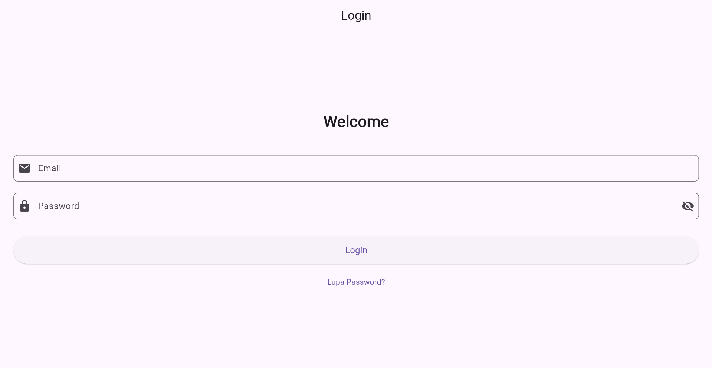
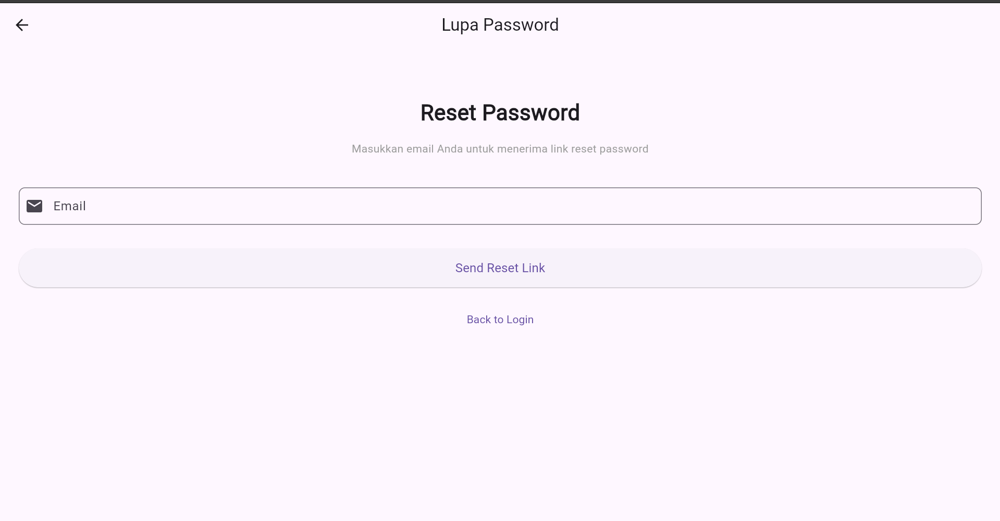
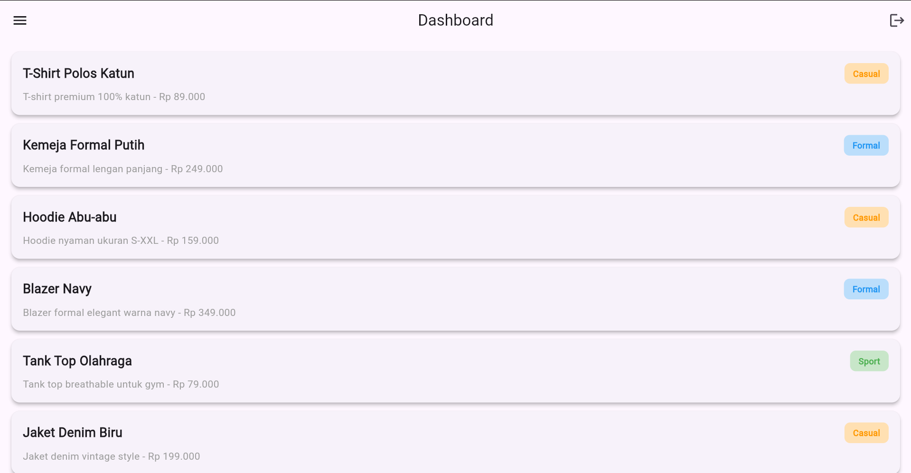

# Mobile Programming - Aplikasi Login dan Dashboard

Aplikasi Flutter sederhana untuk mendemonstrasikan implementasi authentication dengan login, forgot password, dan dashboard dengan product listing.

## 📋 Deskripsi Aplikasi

Aplikasi ini merupakan project pembelajaran Flutter yang mencakup:
- **Authentication System**: Form login dengan validasi email dan password
- **Forgot Password**: Fitur reset password via email
- **Dashboard**: Menampilkan daftar produk baju dengan kategori

Aplikasi dibangun dalam satu file (`lib/main.dart`) untuk memudahkan pembelajaran dan penjelasan konsep Flutter dasar.

## ✨ Fitur Utama

### 1. **Login Screen**
- ✅ Form login dengan email dan password
- ✅ Validasi email menggunakan regex
- ✅ Validasi password (min. 8 karakter, kombinasi huruf + angka)
- ✅ Toggle show/hide password
- ✅ Loading indicator saat proses login
- ✅ SnackBar untuk feedback sukses/error
- ✅ Navigator ke Dashboard dengan passing parameter email

### 2. **Forgot Password Screen**
- ✅ Form input email untuk reset password
- ✅ Validasi email dengan regex
- ✅ Loading indicator saat mengirim reset link
- ✅ SnackBar konfirmasi pengiriman email
- ✅ Back button menggunakan Navigator.pop()

### 3. **Dashboard Screen**
- ✅ Welcome section dengan email user
- ✅ ListView.builder dengan 10 produk baju dummy
- ✅ Card layout dengan elevation dan rounded corner
- ✅ Kategori produk (Casual, Formal, Sport)
- ✅ AppBar dengan logout button (Icons.logout)
- ✅ Drawer menu dengan navigasi
- ✅ Secure logout menggunakan pushAndRemoveUntil

### 4. **Navigation & Security**
- ✅ 3 Route: '/', '/forgot-password', '/dashboard'
- ✅ Parameter passing (email ke dashboard)
- ✅ Aman logout (tidak bisa back ke dashboard)

## 🚀 Cara Menjalankan Aplikasi

### Prerequisites
- Flutter SDK (versi 3.0 atau lebih tinggi)
- Dart SDK
- IDE (Android Studio, VS Code, atau IntelliJ)
- Device/Emulator Android atau iOS

### Langkah-langkah

1. **Clone atau Extract Project**
   ```bash
   cd c:\flutter-projects\mobileprog_icha
   ```

2. **Install Dependencies**
   ```bash
   flutter pub get
   ```

3. **Run Aplikasi**
   ```bash
   flutter run
   ```

   Atau di device spesifik:
   ```bash
   flutter run -d chrome        # Web
   flutter run -d emulator-5554 # Android Emulator
   ```

4. **Build Release (Optional)**
   ```bash
   flutter build apk  # Android APK
   flutter build ios  # iOS (memerlukan Mac)
   ```

## 📱 Screenshots

### 1. Login Screen



**Fitur:**
- Email validation (regex format)
- Password validation (min 8 char, letter + number)
- Toggle show/hide password
- Loading spinner saat login
- Success message ke Dashboard

### 2. Forgot Password Screen


**Fitur:**
- Email input dengan validasi
- Loading indicator saat mengirim
- Confirmation message SnackBar
- Back button dengan Navigator.pop()

### 3. Dashboard Screen



**Fitur:**
- Welcome header dengan email
- Scrollable product list (10 items)
- Card dengan elevation & rounded corner
- Kategori badge (Casual, Formal, Sport)
- Drawer menu & logout button

## 📦 Package yang Digunakan

Aplikasi ini menggunakan package default Flutter (Material Design).

```yaml
dependencies:
  flutter:
    sdk: flutter

dev_dependencies:
  flutter_test:
    sdk: flutter
  flutter_lints: ^2.0.0
```

### Package Deskripsi:
- **flutter**: SDK Flutter dasar untuk build UI
- **flutter_lints**: Linting rules untuk best practices
- **flutter_test**: Testing framework untuk Flutter

## 🏗️ Struktur Project

```
lib/
└── main.dart              # Semua code dalam 1 file
    ├── main()
    ├── MyApp (MaterialApp + Routing)
    ├── LoginScreen (Form + Validasi)
    ├── ForgotPasswordScreen (Form email)
    └── DashboardScreen (List + Drawer)
```

## 📖 Konsep Pembelajaran

Aplikasi ini mengajarkan:

1. **State Management**
   - `StatelessWidget` vs `StatefulWidget`
   - `setState()` untuk update UI

2. **Forms & Validation**
   - `Form` & `GlobalKey<FormState>`
   - `TextFormField` dengan custom validators
   - Regex untuk validasi email

3. **Navigation**
   - `Navigator.pushNamed()`
   - `Navigator.pushReplacementNamed()`
   - `Navigator.pushAndRemoveUntil()`
   - `Navigator.pop()`
   - Parameter passing via `arguments`

4. **UI Components**
   - Material Design widgets
   - `ListView.builder` untuk list dinamis
   - `Card` dengan styling
   - `Drawer` untuk side menu
   - `AppBar` dengan actions
   - `SnackBar` untuk feedback

5. **Async Operations**
   - `Future.delayed()` untuk simulasi API
   - Loading states

## 🎓 Cara Belajar dengan Aplikasi Ini

1. **Pahami Flow**: Login → Dashboard → Logout
2. **Analisis Code**: Baca kode di `main.dart`
3. **Modify**: Ubah colors, text, atau logic
4. **Experiment**: Coba tambah fitur baru
5. **Practice**: Buat screen baru dengan konsep yang sama

## ⚙️ Build & Release

### Android
```bash
flutter build apk --release
# Output: build/app/outputs/flutter-app.apk
```

### iOS (macOS only)
```bash
flutter build ios --release
```

### Web
```bash
flutter build web --release
# Output: build/web/
```

## 🐛 Troubleshooting

| Masalah | Solusi |
|---------|--------|
| `flutter pub get` error | Hapus `pubspec.lock` dan coba lagi |
| Build error | `flutter clean` lalu `flutter pub get` |
| Device tidak terdeteksi | Jalankan `flutter devices` |
| Hot reload tidak bekerja | Tekan `R` atau gunakan `flutter run` |

## 📝 Lisensi

Project ini dibuat untuk pembelajaran. Bebas dimodifikasi dan didistribusikan.

## 👨‍💻 Author

Mobile Programming Learning Project - 2026

---

**Happy Coding! 🚀**
